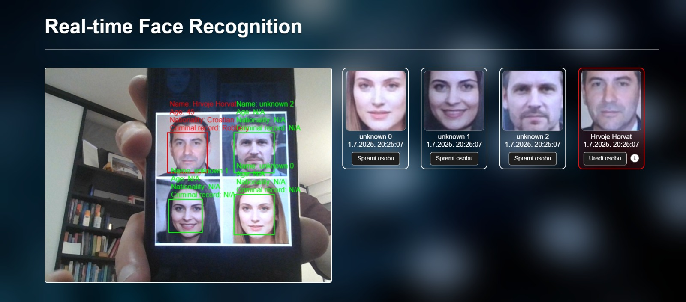
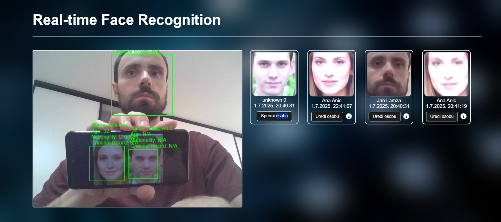

# Face Recognition & Weapon Detection

> Real-time web application for **face recognition and weapon detection** built with **FastAPI**, **OpenCV**, **face_recognition (dlib)**, and **YOLOv11**.  
> Developed as part of a **Master’s thesis in Information Security & Digital Forensics**.

---

## 🖥️ Overview

This application processes live video frames sent from a browser client and performs:

- Real-time **face detection and identification**
- **Unknown person tracking** and gallery storage
- **Weapon detection** (knife, pistol, rifle) using a YOLOv11 model
- Live visualization via **WebSockets**

The system is designed for **security and surveillance scenarios**, where low latency and continuous processing are required.

---

## ⚙️ System Architecture

**Client (Browser)**
- Captures video frames from camera
- Sends frames as Base64 images over WebSocket
- Renders bounding boxes and metadata (faces + weapons)
- Manages UI (person cards, gallery, edit/save forms)

**Server (FastAPI)**
- Receives frames asynchronously via WebSocket
- Decodes frames (OpenCV)
- Runs face recognition and weapon detection in parallel
- Sends detection results back to the client

**Database (PostgreSQL)**
- Stores known persons and metadata
- Stores paths to reference images
- Enables dynamic updates without restarting the app

---

## 🔧 Technologies Used

| Layer | Technology | Purpose |
|-----|-----------|---------|
| Backend | **FastAPI** | REST API & WebSocket server |
| Computer Vision | **OpenCV** | Image decoding, color conversion |
| Face Recognition | **face_recognition**, **dlib** | Face detection & 128-D embeddings |
| Weapon Detection | **YOLOv11 (Ultralytics)** | Real-time object detection |
| Database | **PostgreSQL** | Person metadata & image references |
| Concurrency | **ThreadPoolExecutor**, **asyncio** | Parallel face embedding computation |
| Frontend | HTML, CSS, JavaScript | Live video & detection overlays |
| Data Handling | NumPy, Base64 | Image processing and transport |

---

## 🧠 Face Recognition Pipeline

The face recognition process follows **four standard steps**:

1. **Face Detection**
   - Uses HOG-based detector from `dlib`
   - Optimized for frontal faces and CPU execution

2. **Normalization**
   - Faces are cropped and aligned
   - Converted to RGB before encoding

3. **Embedding Extraction**
   - Each face is converted into a **128-dimensional vector**
   - Computed in parallel using a thread pool

4. **Identification**
   - Uses **Euclidean distance**
   - Match threshold: **0.6**
   - Distance < threshold → same person  
   - Otherwise → unknown person

> Euclidean distance is used strictly as a similarity metric, **not a confidence percentage**.

---

## 🔫 Weapon Detection

- Implemented using **YOLOv11 (Ultralytics)**
- Custom model fine-tuned for:
  - `knife`
  - `pistol`
  - `rifle`
  - `gun`
- Detection constraints:
  - **Confidence ≥ 0.8**
  - **Max 4 weapons per frame**
- Bounding boxes are rendered in **red** with class name and confidence score

---

## ⚡ Performance & Concurrency

- Face embeddings are computed using **ThreadPoolExecutor (4 threads)**
- Face recognition interval: **0.2 seconds**
- Weapon detection interval: **0.2 seconds**
- WebSocket communication is fully asynchronous
- Designed to avoid UI freezing even under heavy processing

---

## 🖼️ Application Screenshots

**Face recognition multiple faces in real time**

**Weapon detection overlay**

---

## ⚡ Features

- Real-time face recognition with metadata overlay
- Unknown person detection and grouping
- Gallery of newly detected faces
- Live weapon detection with confidence filtering
- REST API for person management
- WebSocket-based low-latency streaming
- Multi-client support

---

## 🖥️ Hardware Notes

Tested on the following systems:

- **Intel i5-1335U (CPU only)**  
  - Suitable for low face counts  
  - Noticeable lag with multiple simultaneous detections  

- **Intel i7-14650HX (16 cores / 24 threads)**  
  - Stable real-time performance  
  - Handles parallel face embeddings reliably  

> GPU acceleration (CUDA) **significantly improves YOLO performance**,  
> but the application is fully functional on CPU-only systems.

---

## ⚠️ Limitations

- **HOG-based face detection** struggles with:
  - Full profile faces
  - Very small faces (< ~80×80 px)

- Occlusions (masks, hands, sunglasses) reduce recognition reliability
- Euclidean distance is **not** a probabilistic confidence score
- Weapon detection accuracy depends heavily on training data quality
- No temporal tracking across application restarts

---

## 🚀 Future Improvements

- Switch to **CNN-based face detection**
- Add **violent behavior detection**
- Dockerize the full stack
- GPU acceleration via **CUDA**
- Person re-identification across sessions
- Role-based access control & audit logging

---

## 🎓 Academic Context

This project was developed as part of a **Master’s thesis**:

> **Razvoj aplikacije za prepoznavanje osoba i oružja na temelju vizualnih značajki**  
> University of Applied Sciences Zagreb (TVZ)  
> Information Security & Digital Forensics  
> **Author:** Jan Lamza  
> **Year:** 2025
